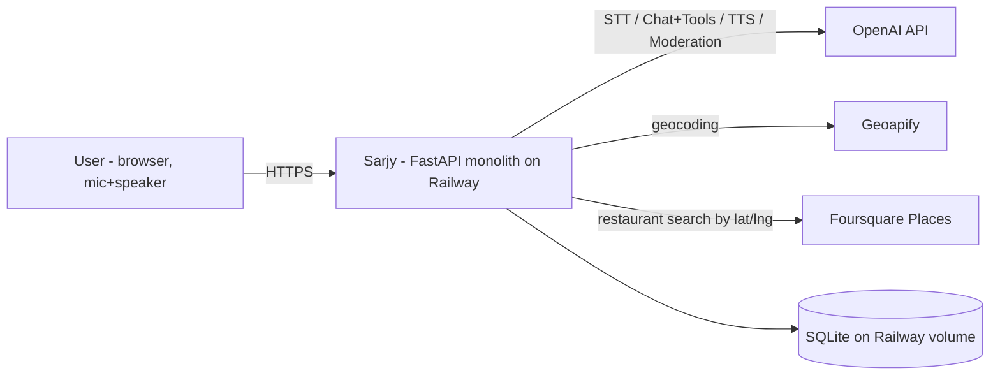
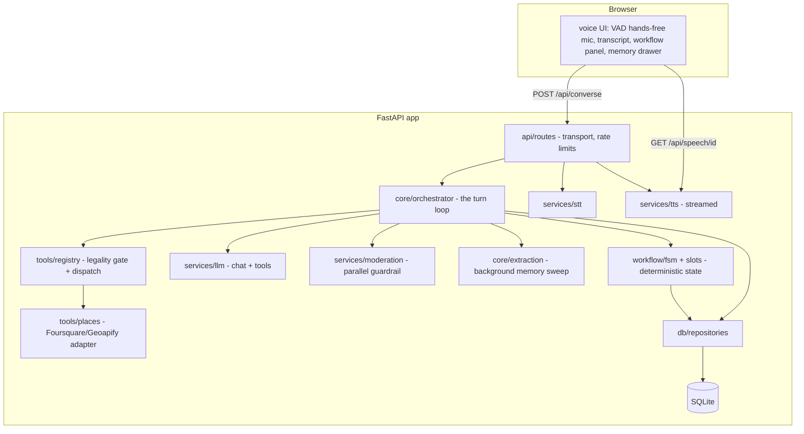
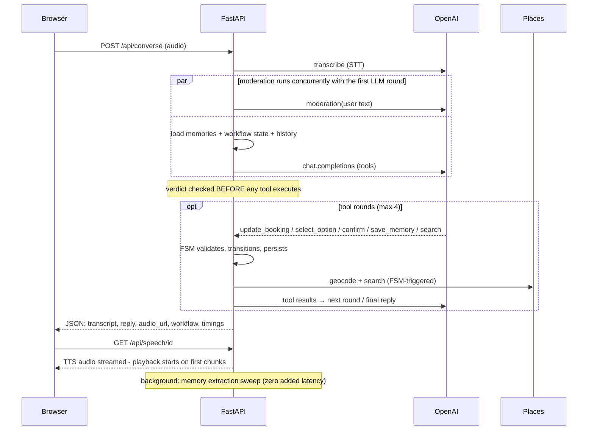
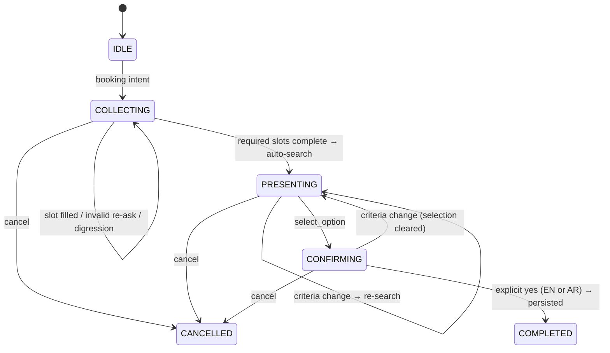

# Architecture

A modular monolith: one FastAPI app, one Docker image, one database file on a
persistent volume. The simplest architecture that satisfies every requirement — each
component sits behind a seam where a heavier replacement could attach (see DECISIONS.md).

## System context

## Components

**Layer responsibilities**

| Layer | Owns | Never does |
|---|---|---|
| `api/` | HTTP transport, validation, rate limits, metrics rows | business logic |
| `core/orchestrator` | the turn loop: context → LLM ⇄ tools → reply | workflow state decisions |
| `workflow/` | FSM states, transitions, guards, slot validation | LLM calls, HTTP (search fn injected) |
| `tools/` | the LLM↔world boundary: specs, legality gate, dispatch | trusting model arguments (Pydantic-validated) |
| `services/` | thin provider adapters (OpenAI, moderation) | retaining state |
| `db/` | persistence behind repositories | leaking SQLAlchemy upward |

## One voice turn

## The deep dive: the booking FSM

**The LLM proposes; the FSM disposes.** Four deterministic guarantees no prompt can
provide:

1. **Tool legality per state** — `confirm_booking` outside `CONFIRMING` is rejected
   before any logic runs; a mid-booking `search_restaurants` call is transparently
   converted into a criteria update + re-search.
2. **Per-field slot validation** — "party of 250 tomorrow at 8" keeps the valid date
   and time, rejects the party size *with a reason* the model relays.
3. **The confirmation double-guard** — booking requires state `CONFIRMING` **and** a
   literal affirmation in the user's own words this turn (`yes`, `نعم`, `تمام`…, with
   negation protection). A prompt injection or model hallucination cannot book.
4. **Persistence every turn** — state survives sessions; a returning user gets a
   resume offer with slots intact.

The FSM takes its search function by injection, so all 30+ workflow tests run with
zero network and zero LLM.

## Memory

Distinct lifecycles, distinct tables — never one blob:

| Store | Scope | Retention |
|---|---|---|
| `messages` (chat context) | per session | 30 days |
| `memories` (stable facts) | per user, cross-session | until user deletes (drawer / "forget X" / forget-all) |
| `bookings` (workflow state) | per user, cross-session | permanent record |
| `turn_metrics` (observability) | global | 30 days |

Facts are captured twice over: the conversational model can call `save_memory`
in-turn, and a **background extraction sweep** (a dedicated LLM pass after every reply,
off the critical path) guarantees capture even when the model just answers. Upserts
make the redundancy harmless. Recall is injection, not retrieval: every fact rides the
system prompt (~200 tokens at realistic scale), so the favorite-color question can
never miss. A server-side guard refuses card-number/ID/credential-shaped values even
if the model tries to save them.

## Trust boundaries & failure paths

- Browser→server: all input validated (UUID identity header, size caps on audio/image,
  Pydantic everywhere). LLM output rendered with `textContent`, never `innerHTML`.
- Server→OpenAI/Foursquare: tool *outputs* are data, never instructions — delimited in
  the prompt, tested with injection strings; the FSM is the structural backstop.
- Every external hop: timeout + bounded retries + a distinct graceful degradation
  (STT fails → typed fallback offered; TTS fails → browser voice; search fails →
  honest "unavailable"; LLM fails → apologetic 503 envelope; moderation outage →
  fail-open). Every error is the standard envelope with a request id — a catch-all
  handler guarantees no stack trace ever leaves the server.
